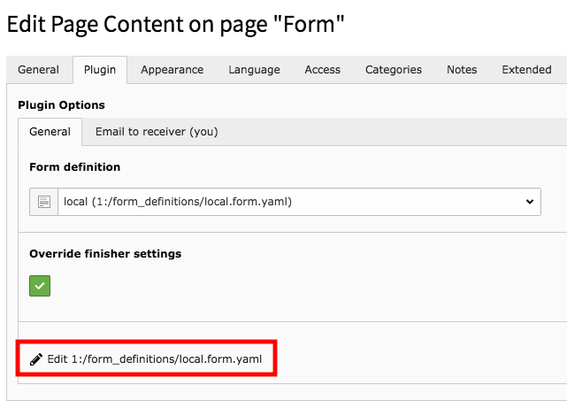
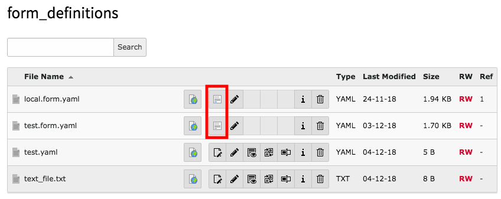

# Form Editor Launcher

This extension enhances the TYPO3 backend to launch the form editing interface directly from the form plugin and the list module.

## Plugin mode

The extension hooks into the flexform rendering and uses the saved value of the plugin to generate a link to the form builder.


  
  
# Filelist mode

The form extension hooks into the list module and deactivates all editing functionality for the yaml files.
This extension runs a hook afterwards and replaces the missing edit button with a link to the form builder.



# Installation

Clone to typo3conf/ext/form_editor_launcher
```
git clone https://github.com/akiessling/t3ext-form_editor_launcher.git
```

or use composer

``` 
composer config repositories.form-editor-launcher vcs https://github.com/akiessling/t3ext-form_editor_launcher.git
composer require andreaskiessling/form-editor-launcher:dev-master
```
